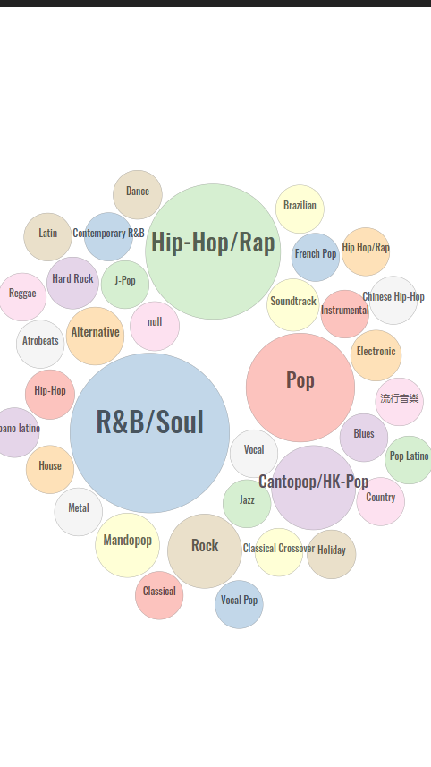

# Visualize Your Apple Music Yearly Review

This is just a toy. The only thing I can guarantee is that your data stays on your devices.

## Grab a copy of your data from Apple

* Sign in to your Apple ID account page at [privacy.apple.com](https://privacy.apple.com/) on a Mac, iPhone, iPad or PC.
* Go to "Request a copy of your data"
* Select at least "Apple Media Services information" and continue
* Apple will then verify your identity and start organizing your data. When the file is ready, it will be available on your Apple ID account page for 14 days.

## Extract the Archive

When the data is ready (might take few weeks), you you will be notified by email. Login to privacy.apple.com again and download it.

The archive is a zip. The script uses the data under "Apple_Media_Services".

**The script only process your data on your computer. The only network traffic is using iTunes API to grab the album artwork**.

## Usage

```
python3 am.py --help
usage: am.py [-h] [-t TZ] [-y N [N ...]] [-d DIR] [-o OUTPUT]

Visualize your Apple Music data

optional arguments:
  -h, --help            show this help message and exit
  -t TZ, --tz TZ        Set timezone of the data (Default: local timezone)
  -y N [N ...], --year N [N ...]
                        Year (Default: current year)
  -d DIR, --dir DIR     Path to the data directory
  -o OUTPUT, --output OUTPUT
                        Output path
```

The visualized data will be under `web/data`. You need a static http server (e.g. Python's builtin) to serve the page and view it.

## Example Output




